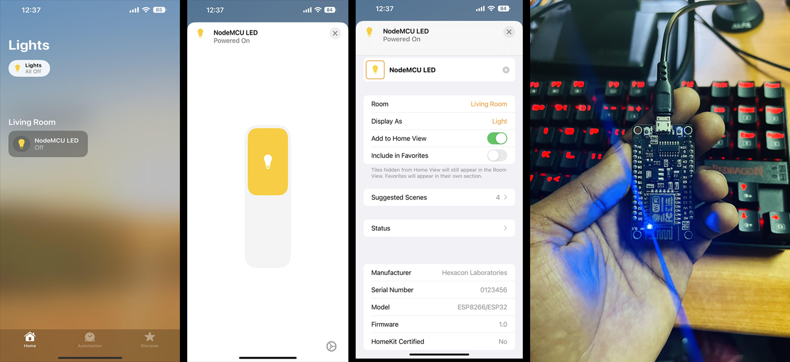

# Arduino HomeKit ESP8266 
## Apple HomeKit accessory server library for ESP8266 Arduino

This Arduino library is a native Apple HomeKit accessory implementation for the [ESP8266 Arduino core](https://github.com/esp8266/Arduino), and works without any additional bridges.

This project is mainly based on [esp-homekit](https://github.com/maximkulkin/esp-homekit) for [ESP-OPEN-RTOS](https://github.com/SuperHouse/esp-open-rtos).

This library is built with ESP8266 Arduino Core 2.6.3.

## Preview



## Setup code of the example sketch

``111-11-111``


## Usage

1. Define your accessory in a .c file to enjoy the  convenient "Macro" style declaration. You can also define your accessory in a .ino file using C++ code.
	```C
		homekit_accessory_t *accessories[] = ...
		homekit_server_config_t config = {
			.accessories = accessories,
			.password = "123-45-678",
			//.on_event = on_homekit_event, //optional
			//.setupId = "ABCD" //optional
		};
	```
2. In your sketch
	```C
		#include <arduino_homekit_server.h>;
		
		//access the config defined in C code
		extern "C" homekit_server_config_t config; 
		
		void setup() {
			WiFi.begin(ssid, password);
			arduino_homekit_setup(&config);
		}
		
		void loop() {
			arduino_homekit_loop();
		}
	```
Done.

## Performance

Notice: You should set the ESP8266 CPU to run at 160MHz (at least during the pairing process), to avoid the tcp-socket disconnection from iOS device caused by timeout.

* Preinit: ~9.1s (You can see the accessory on your iOS HOME app after Preinit)
* Pair Setup Step 1/3: ~0s (The heavy crypto computation is done in Preinit)
* Pair Setup Step 2/3: ~12.1s 
* Pair Setup Step 3/3: ~0.8s  (The pair-setup is only processed when first paired with iOS device)
* Pair Verify Step 1/2: ~0.3s
* Pair Verify Step 2/2: ~0.8s (The Verify Step is required every time iOS connects or reconnects to ESP8266 to establish secure session)

All pairing process takes ~14s after you input the setup-code on your iPhone. Notice that Preinit require ~9s before you can start to pair.

## Storage

* The pairing data is stored in the `EEPROM` address in ESP8266 Arduino core.
* This project does not use the `EEPROM` library with data-cache to reduce memory use (directly call flash_read and write). 
* The `EEPROM` is 4096B in ESP8266, this project uses max [0, 1408B).
* See the comments in `storge.c` and [ESP8266-EEPROM-doc](https://arduino-esp8266.readthedocs.io/en/2.6.3/libraries.html#eeprom).
* `EEPROM` of [1408, 4096) is safe for you to use. 
* This project do NOT use `FS(file system)`, so you can use `FS` freely.


## WatchDog

* There are software and hardware watchdogs in ESP8266 Arduino core. The heavy crypto computing will lead to watchdog reset.
* There are disable/enable api of software-watchdog in ESP8266 Arduino core.
* I found the [esp_hw_wdt](https://github.com/ComSuite/esp_hw_wdt) to disable/enable the hardware-watchdog.
* The two watchdogs are disabled while `Preinit` and `Pair Setup Step 2/3`.

## Recommended settings in IDE

* Module: Generic ESP8266 Module (to enable full settings)
* FlashSize: at least 470KB for sketch
* LwIP Variant: v2 Lower Memory (for lower memory use)
* Debug Level: None (for lower memory use)
* Espressif FW: nonos-sdk 2.2.1+119(191122) (which I used to build this project)
* SSL Support: Basic SSL ciphers (lower ROM use)
* VTables: Flash (does not matter maybe)
* Erase Flash: select `All Flash Contents` when you first upload
* CPU Frequency: 160MHz (must)

## Arduino port

* `ESP8266WiFi` (WiFiServer and WiFiClient) is used for tcp connection.
* `ESP8266mDNS` is used for advertising (Bonjour) 

## Troubleshooting

* Check your serial output with example_serial_output.txt

## Thanks
* [esp-homekit](https://github.com/maximkulkin/esp-homekit)
* [esp-homekit-demo](https://github.com/maximkulkin/esp-homekit-demo)
* [esp_hw_wdt](https://github.com/ComSuite/esp_hw_wdt)
* [WolfSSL/WolfCrypt](https://www.wolfssl.com/products/wolfcrypt-2/)
* [cJSON](https://github.com/DaveGamble/cJSON)
* [cQueue](https://github.com/SMFSW/cQueue)

## Contact

Shibin.AK - [shibin@hexaconlabs.com](mailto:shibin@hexaconlabs.com)
Hexacon Laboratories - [contact@hexaconlabs.com](mailto:contact@hexaconlabs.com)
Project Link: [https://github.com/Hexacon-labs/Apple-HomeKit-ESP8266](https://github.com/Hexacon-labs/Apple-HomeKit-ESP8266)